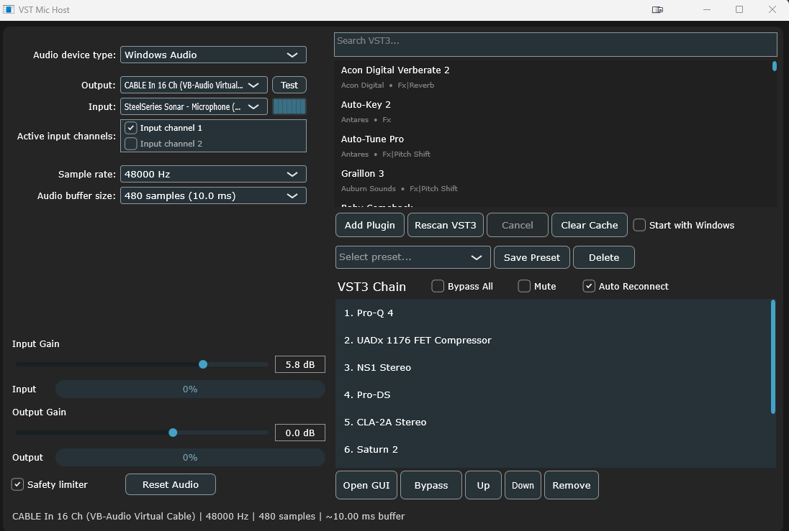

# VST-MIC-HOST-VoxLane-
VoxLane is a portable real-time VST3 microphone host and audio processor for Windows, built with C++ and JUCE.

It allows you to route your microphone through a customizable VST3 plugin chain and send the processed signal to a selected audio output.

No installation is required — VoxLane can be run as a portable application.

## Screenshot

## Features

- VST3 plugin scanning and loading
- Custom VST3 processing chain
- Plugin reordering and bypass
- Plugin GUI support
- Input and output device selection
- Sample rate and buffer size configuration
- Active input channel selection
- Input and output gain controls
- Preset saving and loading
- Safety limiter
- Automatic audio reconnection
- Start with Windows option
- Portable — no installation required

## Using VoxLane with a Virtual Audio Cable

To use your processed microphone signal in Discord, OBS, games or other applications, VoxLane can be used together with a virtual audio cable.

You can use:

[VB-CABLE Virtual Audio Device](https://vb-audio.com/Cable/)

### Setup

1. Install VB-CABLE.
2. Open VoxLane.
3. Select your physical microphone as the input device.
4. Select `CABLE Input` as the output device.
5. Add and configure your VST3 plugins.
6. In Discord, OBS, a game or another application, select `CABLE Output` as your microphone/input device.

Audio routing:

`Microphone → VoxLane → VST3 Chain → VB-CABLE → Discord / OBS / Game / Other App`

The application will then receive the microphone signal after it has been processed by VoxLane.

## Planned Features

Future versions of VoxLane are planned to include:

- Original built-in audio plugins
- Audio processing without requiring external VST3 plugins
- **Fun Voices** — presets for funny and unusual voice effects created using VoxLane's built-in plugins
- More preset options
- Additional audio processing and routing features

## Open Source

VoxLane is currently under development.

The project is planned to become open source in the future.
